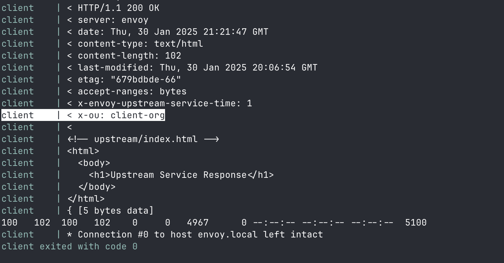

# Envoy mTLS with Client Certificate OU Extraction

This project demonstrates how to set up **Envoy** as a reverse proxy with **mTLS** (mutual TLS) support to authenticate and authorize client connections. The key feature is the extraction of the **Organizational Unit (OU)** from the client certificate and forwarding it as a custom header (`X-OU`) to the upstream service.

## Overview

The setup consists of three main components:
1. **Envoy Proxy**: Handles incoming HTTPS requests, performs mTLS authentication with the client, and forwards requests to an upstream service while adding a custom `X-OU` header with the **OU** from the client certificate.
2. **Upstream Service**: A simple HTTP server (e.g., Nginx) that serves static content or application data.
3. **Client**: A client that connects to Envoy using a client certificate, presenting its identity to Envoy for authentication.

### Key Features:
- **mTLS Authentication**: Envoy verifies the client’s certificate during the TLS handshake.
- **OU Extraction**: The **OU** (Organizational Unit) field from the client's certificate is extracted and added to the request as a response header.
- **Response Header Modification**: Envoy adds the extracted **OU** to the response as an `X-OU` header before passing it back to the client.

## Prerequisites

- Docker and Docker Compose
- OpenSSL (to generate certificates)

## How to Use

### 1. **Generate Certificates**

You need to create a **CA certificate**, a **server certificate** for Envoy, and a **client certificate** for mTLS. You can generate these certificates using OpenSSL. 

Use the following commands to generate the required certificates:
```bash
./gen-certs.sh
```

### 2. **Run the Docker Compose Setup**

```bash
docker-compose up
```

This will start:
	•	Envoy listening on https://localhost:8080.
	•	Upstream service (Nginx) running as a backend service.
	•	Client making a request to Envoy using the client certificate.


### 3. **Test the Setup**

look at the logs of client container to see the response headers.


### 4. **Structure**
	•	gen-certs.sh: The script to generate the certificates.
	•	certs/: Contains the generated certificates (CA, server, client) from step 1.
	•	upstream/: The directory with files served by the upstream Nginx service.
	•	docker-compose.yml: Defines the containers for Envoy, upstream service, and client.
	•	envoy.yaml: The Envoy configuration file, including the Lua filter for extracting the OU from the client certificate.

### 5. **Conclusion**

This setup demonstrates how to use Envoy for mTLS authentication and client certificate management, and how to extract and forward certificate data (such as the OU) in the response headers for use by downstream services.
